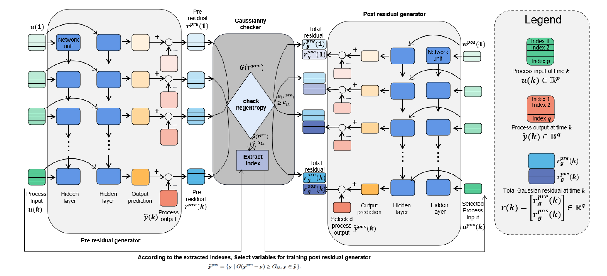

# A New End-to-End Monitoring Framework for Nonlinear Dynamic Processes with Unknown Noise Statistics
---------------------

How to use it?
---------------------

Directly run python file to train models using dataset of ship.

Citation
---------------------

**Please kindly cite the papers if this code is useful and helpful for your research.**

     @article{hong2017learning,
      title     = {A New End-to-End Monitoring Framework for Nonlinear Dynamic Processes with Unknown Noise Statistics},
      author    = {X. Xiu and Y. Zhang and Y. Guo and X. Liu and Y. Yang},
      journal   = {IEEE Transactions on Instrumentation and Measurement},
      volume    = {73},
      pages     = {1--10},
      year      = {2024},
      publisher = {IEEE}
     }

