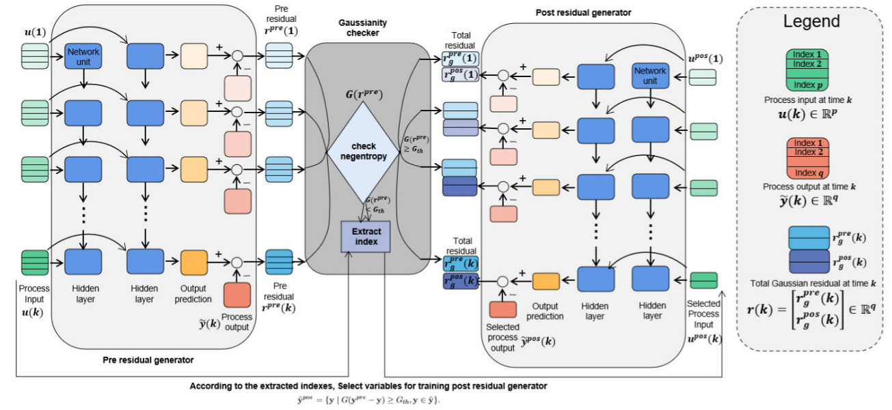

# DRNN

The code in this toolbox implements ["A New End-to-End Monitoring Framework for Nonlinear Dynamic Processes with Unknown Noise Statistics"](https://ieeexplore.ieee.org/abstract/document/10464356) by <i>X. Xiu, Y. Zhang, Y. Guo, X. Liu, Y. Yang</i>.

### Testing
Directly run demo.py for reproduction.

### Citation
Please give credits to this paper if this code is useful and helpful for your research.

     @article{xiu2024new,
      title     = {A New End-to-End Monitoring Framework for Nonlinear Dynamic Processes with Unknown Noise Statistics},
      author    = {Xiu, Xianchao and Zhang, Yuhan and Guo, Yufei and Liu, Xiaode and Yang, Ying},
      journal   = {IEEE Transactions on Instrumentation and Measurement},
      year      = {2024},
      volume    = {73},
      pages     = {1--10},
      publisher = {IEEE}
     }

